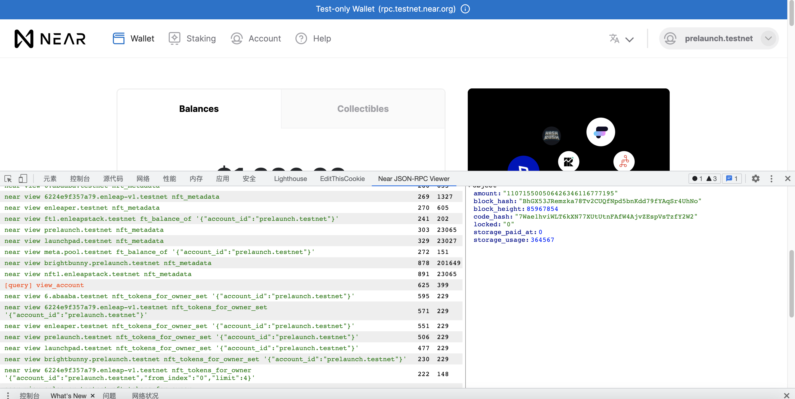

# Near JSON-RPC Viewer
Updated to parse Near rpc requests
base on JSON-RPC Viewer

features update:
regex search bar    03/28/2022

snapshot: 

## How to use 
1. Open `chrome://extensions`

2. import `./dist` as a extension 

# JSON-RPC Viewer
JSON-RPC Viewer is an extension to help viewing JSON-RPC requests in a more convenient way than Network tab allows.
You can view a list of requests with method name, params and result/response.
Supports JSON-RPC batch requests from version 1.1.1

Feature requests, bug reports and pull requests are welcome here: https://github.com/kityan/json-rpc-viewer.

You can install it from Chrome Web Store: https://chrome.google.com/webstore/detail/json-rpc-viewer/hnmcofcmhpllkdkncnofkjdlpieagngg.